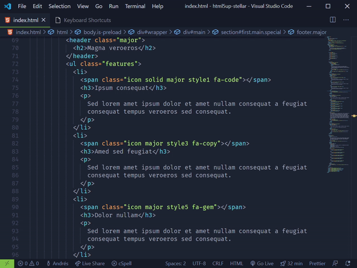
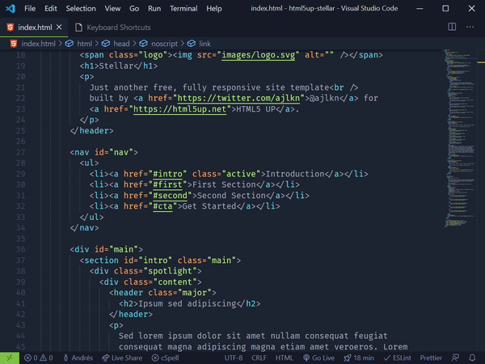
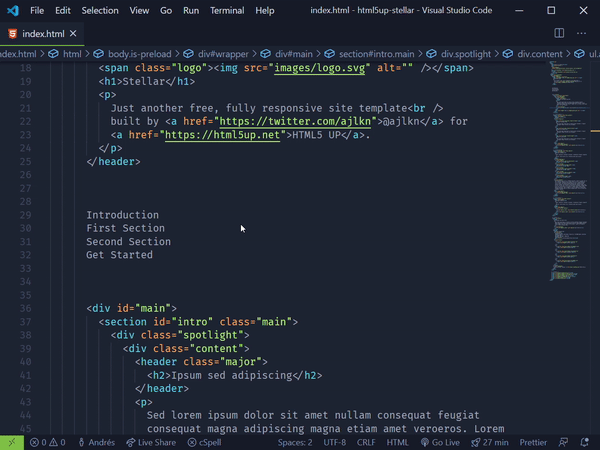
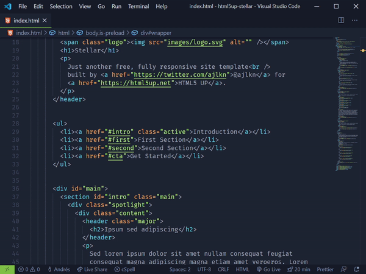

# Emmet Keybindings for VS Code

Practical keybindings for Emmet on VS Code

## Balance (Outward/Inward)

Balance (Outward / Inward):

- Mac: <kbd>Cmd</kbd> + <kbd>M</kbd>  <kbd>O</kbd> / <kbd>Cmd</kbd> + <kbd>M</kbd>  <kbd>I</kbd>
- Windows/Linux: <kbd>Ctrl</kbd> + <kbd>M</kbd>  <kbd>O</kbd> / <kbd>Ctrl</kbd> + <kbd>M</kbd>  <kbd>I</kbd>

## Evaluate Math Expression

- Mac: <kbd>Cmd</kbd> + <kbd>M</kbd>  <kbd>E</kbd>
- Windows/Linux: <kbd>Ctrl</kbd> + <kbd>M</kbd>  <kbd>E</kbd>

## Go to Matching Pair

- Mac: <kbd>Cmd</kbd> + <kbd>M</kbd>  <kbd>M</kbd>
- Windows/Linux: <kbd>Ctrl</kbd> + <kbd>M</kbd>  <kbd>M</kbd>

## Remove Tag

- Mac: <kbd>Cmd</kbd> + <kbd>M</kbd>  <kbd>Backspace</kbd>
- Windows/Linux: <kbd>Ctrl</kbd> + <kbd>M</kbd>  <kbd>Backspace</kbd>

## Toggle Comment

- Mac: <kbd>Cmd</kbd> + <kbd>M</kbd>  <kbd>/</kbd>
- Windows/Linux: <kbd>Ctrl</kbd> + <kbd>M</kbd>  <kbd>/</kbd>

## Wrap Individual Lines with Abbreviation  

- Mac: <kbd>Cmd</kbd> + <kbd>M</kbd>  <kbd>Cmd</kbd> +<kbd>W</kbd>  
- Windows/Linux: <kbd>Ctrl</kbd> + <kbd>M</kbd>  <kbd>Ctrl</kbd> + <kbd>W</kbd>  

## Wrap with Abbreviation

- Mac: <kbd>Cmd</kbd> + <kbd>M</kbd>  <kbd>W</kbd>
- Windows/Linux: <kbd>Ctrl</kbd> + <kbd>M</kbd>  <kbd>W</kbd>

## Keybindings

| Command                                 | Mac                                                          | Windows                                                        |
| --------------------------------------- | ------------------------------------------------------------ | -------------------------------------------------------------- |
| Balance (Inward)                        | <kbd>Cmd</kbd> + <kbd>M</kbd>  <kbd>I</kbd>                  | <kbd>Ctrl</kbd> + <kbd>M</kbd>  <kbd>I</kbd>                   |
| Balance (Outward)                       | <kbd>Cmd</kbd> + <kbd>M</kbd>  <kbd>O</kbd>                  | <kbd>Ctrl</kbd> + <kbd>M</kbd>  <kbd>O</kbd>                   |
| Evaluate Math Expression                | <kbd>Cmd</kbd> + <kbd>M</kbd>  <kbd>E</kbd>                  | <kbd>Ctrl</kbd> + <kbd>M</kbd>  <kbd>E</kbd>                   |
| Go to Matching Pair                     | <kbd>Cmd</kbd> + <kbd>M</kbd>  <kbd>M</kbd>                  | <kbd>Ctrl</kbd> + <kbd>M</kbd>  <kbd>M</kbd>                   |
| Go to Next Edit Point                   | <kbd>Cmd</kbd> + <kbd>M</kbd>  <kbd>K</kbd>                  | <kbd>Ctrl</kbd> + <kbd>M</kbd>  <kbd>K</kbd>                   |
| Go to Previous Edit Point               | <kbd>Cmd</kbd> + <kbd>M</kbd>  <kbd>J</kbd>                  | <kbd>Ctrl</kbd> + <kbd>M</kbd>  <kbd>J</kbd>                   |
| Merge Lines                             | <kbd>Cmd</kbd> + <kbd>M</kbd>  <kbd>L</kbd>                  | <kbd>Ctrl</kbd> + <kbd>M</kbd>  <kbd>L</kbd>                   |
| Reflect CSS Value                       | <kbd>Cmd</kbd> + <kbd>M</kbd>  <kbd>R</kbd>                  | <kbd>Ctrl</kbd> + <kbd>M</kbd>  <kbd>R</kbd>                   |
| Remove Tag                              | <kbd>Cmd</kbd> + <kbd>M</kbd>  <kbd>Backspace</kbd>          | <kbd>Ctrl</kbd> + <kbd>M</kbd>  <kbd>Backspace</kbd>           |
| Select Next Item                        | <kbd>Cmd</kbd> + <kbd>M</kbd>  <kbd>.</kbd>                  | <kbd>Ctrl</kbd> + <kbd>M</kbd>  <kbd>.</kbd>                   |
| Select Previous Item                    | <kbd>Cmd</kbd> + <kbd>M</kbd>  <kbd>,</kbd>                  | <kbd>Ctrl</kbd> + <kbd>M</kbd>  <kbd>,</kbd>                   |
| Split/Join Tag                          | <kbd>Cmd</kbd> + <kbd>M</kbd>  <kbd>S</kbd>                  | <kbd>Ctrl</kbd> + <kbd>M</kbd>  <kbd>S</kbd>                   |
| Toggle Comment                          | <kbd>Cmd</kbd> + <kbd>M</kbd>  <kbd>/</kbd>                  | <kbd>Ctrl</kbd> + <kbd>M</kbd>  <kbd>/</kbd>                   |
| Update Image Size                       | <kbd>Cmd</kbd> + <kbd>M</kbd>  <kbd>U</kbd>                  | <kbd>Ctrl</kbd> + <kbd>M</kbd>  <kbd>U</kbd>                   |
| Update Tag                              | <kbd>Cmd</kbd> + <kbd>M</kbd>  <kbd>T</kbd>                  | <kbd>Ctrl</kbd> + <kbd>M</kbd>  <kbd>T</kbd>                   |
| Wrap Individual Lines with Abbreviation | <kbd>Cmd</kbd> + <kbd>M</kbd>  <kbd>Cmd</kbd> + <kbd>W</kbd> | <kbd>Ctrl</kbd> + <kbd>M</kbd>  <kbd>Ctrl</kbd> + <kbd>W</kbd> |
| Wrap with Abbreviation                  | <kbd>Cmd</kbd> + <kbd>M</kbd>  <kbd>W</kbd>                  | <kbd>Ctrl</kbd> + <kbd>M</kbd>  <kbd>W</kbd>                   |
